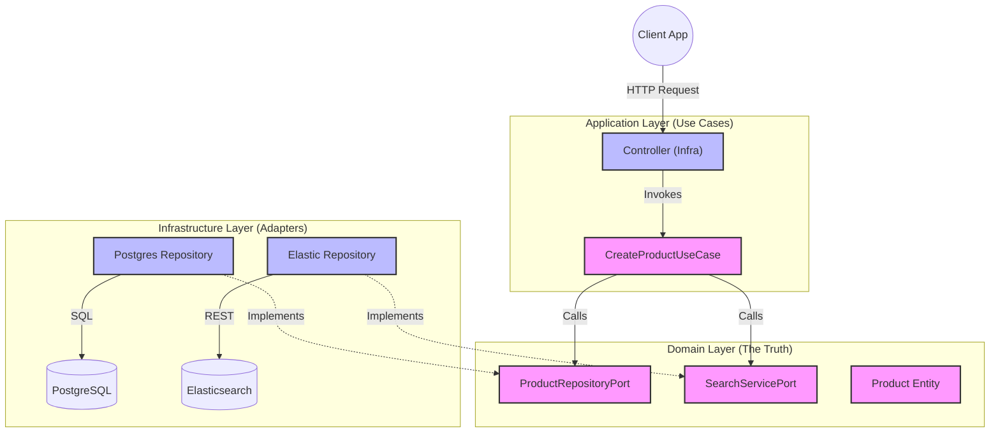

# Scalable Product Search Engine

> **High-Performance Search Microservice built with Hexagonal Architecture.**
> Designed for scalability, maintainability, and sub-millisecond search latencies using Elasticsearch and Redis.

## Why This Project?
This is not just a CRUD application. It is a production-ready template demonstrating how to solve complex backend challenges:
- **Decoupling Business Logic**: Hexagonal Architecture ensures the core domain is isolated from infrastructure changes.
- **High Performance**: Elasticsearch handles complex queries that would choke a relational database.
- **Scalability**: Stateless architecture containerized with Docker, ready for orchestration.

## Enterprise-Grade Components

| Component | Technology | Role |
|-----------|------------|------|
| **Core Framework** | NestJS (Node.js) | Typesafe, modular backend framework. |
| **Architecture** | Hexagonal (Ports & Adapters) | Future-proof code structure. |
| **Search Engine** | Elasticsearch 7.17 | Fuzzy search, ranking, and high-speed retrieval. |
| **Primary DB** | PostgreSQL + TypeORM | ACID compliant source of truth. |
| **Caching** | Redis | Sub-millisecond data access for hot paths. |
| **Infrastructure** | Docker & Docker Compose | Identical environments from dev to prod. |

## Architecture Overview

The system follows a strict **Hexagonal Architecture**. The application core (Use Cases) interacts with the outside world (Database, API, Search Engine) exclusively through **Ports** (Interfaces).



### Data Flow Example: Creating a Product
1. **API**: `ProductController` receives the JSON payload.
2. **UseCase**: Orchestrates the transaction.
3. **Primary**: Saves the product to **PostgreSQL** (Source of Truth).
4. **Secondary**: Indexes the product in **Elasticsearch** (Search Optimization) via the Search Port.

## Quick Start

Get the entire system running in less than 2 minutes.

### Prerequisites
- Docker & Docker Compose

### Run (One Command)
```bash
# Clone and run
git clone https://github.com/AngelPenalver/Backend-Technical-Challenge-Advanced-Search-System.git
cd Backend-Technical-Challenge-Advanced-Search-System
cp .env.example .env

# This spins up Postgres, Elastic, Redis, and the App
docker compose up --build -d
```
> The API will be available at: `http://localhost:3000`

## API Documentation
The system includes auto-generated Swagger documentation.
- **Swagger UI**: [http://localhost:3000/api/docs](http://localhost:3000/api/docs)

### Core Endpoints
| Method | Endpoint | Description |
|--------|----------|-------------|
| `POST` | `/products` | Create a product & auto-index in Elastic. |
| `GET` | `/products/search` | Full-text search with filters (Elasticsearch). |
| `GET` | `/products/autocomplete` | Fast autocomplete suggestions. |

---
**Author**: Ángel Peñalver
*Built with passion for clean code and scalability.*