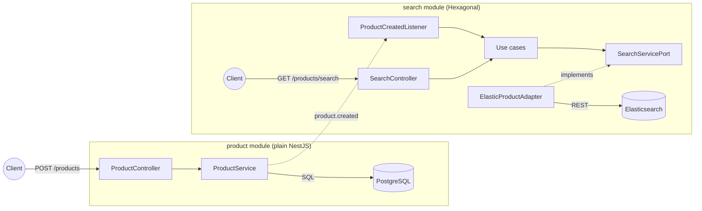

# Product Search API

> A product search service built with **NestJS, PostgreSQL and Elasticsearch** as a backend technical challenge — delivered in **3 days** while learning Hexagonal Architecture, Elasticsearch and Redis from scratch.

## Context

This was my submission for a backend technical challenge with a 3-day deadline. When I started, I had never used Hexagonal Architecture, Elasticsearch or Redis, so a large part of the work was learning them while building.

After the challenge I reviewed it with more experience. I reorganized the modules so Hexagonal Architecture is applied only where it pays off (see [Architecture](#architecture)), and documented the remaining issues in [Known limitations and what I'd improve](#known-limitations-and-what-id-improve).

## What It Does

- **Create products** — stored in PostgreSQL and indexed in Elasticsearch.
- **Full-text search** — typo-tolerant, with filters by category, subcategory, location and price range, plus sorting and pagination.
- **Autocomplete** — suggestions on product names as the user types.
- **Caching** — search and autocomplete results are cached in memory.
- **Seed data** — 50 random products are generated on first start.

## Tech Stack

| Component | Technology | Role |
|-----------|------------|------|
| **Framework** | NestJS (TypeScript) | REST API and dependency injection. |
| **Architecture** | Modular; Hexagonal in `search` | Ports & adapters only where there is an external engine to isolate. |
| **Events** | `@nestjs/event-emitter` | Decouples product creation from indexing. |
| **Search engine** | Elasticsearch 7.17 | Full-text search, filters and autocomplete. |
| **Database** | PostgreSQL + TypeORM | Source of truth for products. |
| **Cache** | cache-manager (in-memory) | Caches search and autocomplete results. |
| **Docs** | Swagger / OpenAPI | Interactive API documentation. |
| **Environment** | Docker Compose | App, PostgreSQL, Elasticsearch, Redis and pgAdmin. |

## Architecture

The code is split into two modules with different needs, and each one gets only the structure it needs:

| Module | Responsibility | Structure |
|--------|----------------|-----------|
| `product` | Create products and store them in PostgreSQL, the **source of truth**. | Plain NestJS: controller, service and TypeORM repository. |
| `search` | Full-text search, autocomplete and caching over **Elasticsearch**. | Hexagonal: use cases depend on a `SearchServicePort`; Elasticsearch is an adapter. |

**Why Hexagonal only in `search`?** Creating products is a simple CRUD with no complex business rules, so ports and adapters there would add files without adding value. Search is different: it depends on an external engine with its own query language, and isolating it behind a port keeps the search logic testable without Elasticsearch and replaceable if the engine changes.

**Dependency direction:** `search` depends on `product`, never the other way around. When a product is saved, `product` emits a `product.created` event; `search` listens to it and indexes the product. The product module doesn't know that search exists.


```mermaid
graph LR
    Client(("Client")) -->|POST /products| ProductController

    subgraph product ["product module (plain NestJS)"]
        ProductController --> ProductService
        ProductService -->|SQL| DB[("PostgreSQL")]
    end

    ProductService -.->|product.created| Listener

    subgraph search ["search module (Hexagonal)"]
        Client2(("Client")) -->|GET /products/search| SearchController
        Listener["ProductCreatedListener"] --> UseCases["Use cases"]
        SearchController --> UseCases
        UseCases --> Port["SearchServicePort"]
        Adapter["ElasticProductAdapter"] -.->|implements| Port
        Adapter -->|REST| Elastic[("Elasticsearch")]
    end
```

### Search Design

- **Typo tolerance**: `multi_match` with `fuzziness: AUTO`, so "laptp" still finds "laptop".
- **Field weighting**: matches in `name` count twice as much as matches in `description` (`name^2`).
- **Filters that don't affect ranking**: category, subcategory, location and price go in the `bool.filter` clause, so they narrow results without changing relevance scores.
- **Explicit mapping**: `keyword` fields for exact filters, and a `name.keyword` sub-field to sort by name.
- **Autocomplete**: `match_phrase_prefix` on the product name, limited to 5 suggestions.

### Data Flow: Creating a Product

1. `ProductController` receives and validates the payload.
2. `ProductService` checks that no product with the same name exists.
3. The product is saved in **PostgreSQL**, the source of truth.
4. `ProductService` emits `product.created` and responds to the client.
5. `ProductCreatedListener` (search module) indexes the product in **Elasticsearch**.

Indexing happens after the response, so search is **eventually consistent**: a new product becomes searchable shortly after it's created. If indexing fails, the product still exists in PostgreSQL — see [limitation #1](#1-indexing-without-retries).

## Quick Start

### Prerequisites
- Docker & Docker Compose

### Run
```bash
git clone https://github.com/AngelPenalver/Backend-Technical-Challenge-Advanced-Search-System.git
cd Backend-Technical-Challenge-Advanced-Search-System
cp .env.example .env

# Starts PostgreSQL, Elasticsearch, Redis, pgAdmin and the app
docker compose up --build -d
```
> The API will be available at `http://localhost:3000/api`.

### Tests
```bash
pnpm install
pnpm test
```
Unit tests cover product creation (save before emitting the event, duplicate names), the indexing listener, the search use cases (cache hits and misses), the validation of search parameters and the Elasticsearch query builder (fuzzy matching, filters, price ranges, sorting and pagination).

## API Documentation

- **Swagger UI**: [http://localhost:3000/api/docs](http://localhost:3000/api/docs)
- **Postman collection**: `Product-Search-API.postman_collection.json`

| Method | Endpoint | Description |
|--------|----------|-------------|
| `POST` | `/api/products` | Create a product; it's indexed in Elasticsearch asynchronously. |
| `GET` | `/api/products/search` | Full-text search with filters, sorting and pagination. |
| `GET` | `/api/products/autocomplete` | Autocomplete suggestions for product names. |

## Known Limitations and What I'd Improve

### 1. Indexing without retries
In the original version, the product was indexed in Elasticsearch *before* saving it in PostgreSQL, so a failed database write left an orphan document that users could find. Now PostgreSQL is written first and Elasticsearch is updated from an event, so the index can never contain a product that doesn't exist.

The remaining gap: the event is in-process and has no retries. If Elasticsearch is down, or the app stops between saving and indexing, the product exists in PostgreSQL but never appears in search.

**Improvement:** use the *transactional outbox* pattern (store the event in the same database transaction as the product, and have a worker publish it with retries), and add a job that can rebuild the whole index from PostgreSQL.

### 2. Redis is not actually used
Redis runs in Docker Compose and the `redis` package is installed, but the cache module has no Redis store configured, so results are cached **in the memory of each app instance**. With more than one instance, each would keep its own cache.

**Improvement:** configure a Redis store for `CacheModule` so all instances share the same cache.

### 3. Cache TTL and invalidation
In the cache-manager version used, TTLs are in **milliseconds**, so `60 * 60 * 24` gives about 86 seconds instead of the intended 24 hours. A 24-hour TTL would be a bigger problem, though: creating a product doesn't invalidate cached searches, so new products wouldn't show up until the cache expired.

**Improvement:** define TTLs explicitly in milliseconds, keep them short for search results, and invalidate (or version) cached keys when products change.

### 4. Search results don't include the product `id`
The `id` is used as the Elasticsearch document ID but isn't stored in the document body, and search returns only `_source`. Clients receive products without an identifier.

**Improvement:** map results from `hit._id` + `hit._source`, or store the `id` in the document.

### 5. Race condition on unique product names
Uniqueness is checked with "find by name, then save" (*check-then-act*). Two concurrent requests with the same name can both pass the check, and there is no `UNIQUE` constraint on `name` in the database. The seeder creates 50 random products in parallel, so this can actually happen.

**Improvement:** add a `UNIQUE` constraint on `name` and translate the constraint violation into a `409 Conflict`.

### Other improvements
- **Dependencies**: Elasticsearch, cache-manager, `@nestjs/config` and faker are used at runtime but listed in `devDependencies`. That's why the Dockerfile installs all dependencies in the production image; fixing the classification would allow a production-only install.
- **Pagination limits**: `limit` and `offset` have no maximum. Elasticsearch rejects `offset + limit` above 10,000 by default, which currently surfaces as a 500 error.
- **Seeding**: it runs on every application start. It should be a separate script, so multiple instances don't seed concurrently.
- **Index creation errors** at startup are only logged, and the app keeps running without a valid index.
- **Configuration**: environment variables aren't validated at startup, and `synchronize: true` should be replaced with migrations.
- **Tests**: unit tests cover product creation, the indexing listener, the search use cases, the search parameter validation and the Elasticsearch query builder. Still missing: an integration test against a real Elasticsearch, to verify the mapping and relevance end to end.

---
**Author**: Ángel Peñalver
