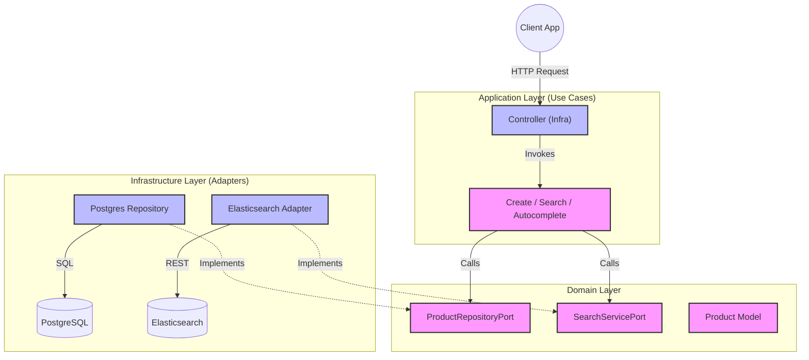

# Product Search API

> A product search service built with **NestJS, PostgreSQL and Elasticsearch** as a backend technical challenge — delivered in **3 days** while learning Hexagonal Architecture, Elasticsearch and Redis from scratch.

## Context

This was my submission for a backend technical challenge with a 3-day deadline. When I started, I had never used Hexagonal Architecture, Elasticsearch or Redis, so a large part of the work was learning them while building.

The code is kept as delivered. After reviewing it later with more experience, I documented what I would change today in [Known limitations and what I'd improve](#known-limitations-and-what-id-improve).

## What It Does

- **Create products** — stored in PostgreSQL and indexed in Elasticsearch.
- **Full-text search** — typo-tolerant, with filters by category, subcategory, location and price range, plus sorting and pagination.
- **Autocomplete** — suggestions on product names as the user types.
- **Caching** — search and autocomplete results are cached in memory.
- **Seed data** — 50 random products are generated on first start.

## Tech Stack

| Component | Technology | Role |
|-----------|------------|------|
| **Framework** | NestJS (TypeScript) | REST API and dependency injection. |
| **Architecture** | Hexagonal (Ports & Adapters) | Use cases depend on ports, not on infrastructure. |
| **Search engine** | Elasticsearch 7.17 | Full-text search, filters and autocomplete. |
| **Database** | PostgreSQL + TypeORM | Source of truth for products. |
| **Cache** | cache-manager (in-memory) | Caches search and autocomplete results. |
| **Docs** | Swagger / OpenAPI | Interactive API documentation. |
| **Environment** | Docker Compose | App, PostgreSQL, Elasticsearch, Redis and pgAdmin. |

## Architecture

The application core (use cases) talks to the outside world (database, search engine) only through **ports** (abstract classes). Infrastructure adapters implement those ports, so the core does not depend on TypeORM or Elasticsearch.


```mermaid
graph TD
    Client(("Client App")) -->|HTTP Request| Controller["Controller (Infra)"]

    subgraph "Application Layer (Use Cases)"
        Controller -->|Invokes| UseCase["Create / Search / Autocomplete"]
    end

    subgraph "Domain Layer"
        UseCase -->|Calls| PortRepo["ProductRepositoryPort"]
        UseCase -->|Calls| PortSearch["SearchServicePort"]
        Model["Product Model"]
    end

    subgraph "Infrastructure Layer (Adapters)"
        RepoAdapter["Postgres Repository"] -.->|Implements| PortRepo
        SearchAdapter["Elasticsearch Adapter"] -.->|Implements| PortSearch

        RepoAdapter -->|SQL| DB[("PostgreSQL")]
        SearchAdapter -->|REST| Elastic[("Elasticsearch")]
    end

    classDef domain fill:#f9f,stroke:#333,stroke-width:2px;
    classDef infra fill:#bbf,stroke:#333,stroke-width:2px;

    class UseCase,PortRepo,PortSearch,Model domain;
    class Controller,RepoAdapter,SearchAdapter infra;
```

### Search Design

- **Typo tolerance**: `multi_match` with `fuzziness: AUTO`, so "laptp" still finds "laptop".
- **Field weighting**: matches in `name` count twice as much as matches in `description` (`name^2`).
- **Filters that don't affect ranking**: category, subcategory, location and price go in the `bool.filter` clause, so they narrow results without changing relevance scores.
- **Explicit mapping**: `keyword` fields for exact filters, and a `name.keyword` sub-field to sort by name.
- **Autocomplete**: `match_phrase_prefix` on the product name, limited to 5 suggestions.

### Data Flow: Creating a Product

1. `ProductController` receives and validates the payload.
2. `CreateProductUseCase` checks that no product with the same name exists.
3. The product is indexed in **Elasticsearch**.
4. If indexing succeeds, it is saved in **PostgreSQL**.

> This two-step write is not atomic — see [limitation #1](#1-dual-write-between-elasticsearch-and-postgresql).

## Quick Start

### Prerequisites
- Docker & Docker Compose

### Run
```bash
git clone https://github.com/AngelPenalver/Backend-Technical-Challenge-Advanced-Search-System.git
cd Backend-Technical-Challenge-Advanced-Search-System
cp .env.example .env

# Starts PostgreSQL, Elasticsearch, Redis, pgAdmin and the app
docker compose up --build -d
```
> The API will be available at `http://localhost:3000/api`.

## API Documentation

- **Swagger UI**: [http://localhost:3000/api/docs](http://localhost:3000/api/docs)
- **Postman collection**: `Product-Search-API.postman_collection.json`

| Method | Endpoint | Description |
|--------|----------|-------------|
| `POST` | `/api/products` | Create a product and index it in Elasticsearch. |
| `GET` | `/api/products/search` | Full-text search with filters, sorting and pagination. |
| `GET` | `/api/products/autocomplete` | Autocomplete suggestions for product names. |

## Known Limitations and What I'd Improve

### 1. Dual write between Elasticsearch and PostgreSQL
Creating a product writes to two systems without a shared transaction. Indexing in Elasticsearch first avoids products that exist in the database but can't be found. However, if the PostgreSQL write then fails, an orphan document stays in the index — and since search reads from Elasticsearch, users can see a product that doesn't exist.

**Improvement:** treat PostgreSQL as the single source of truth. Save there first, then update Elasticsearch asynchronously with retries (for example, with the *transactional outbox* pattern), and add a job that can rebuild the whole index from the database.

### 2. Redis is not actually used
Redis runs in Docker Compose and the `redis` package is installed, but the cache module has no Redis store configured, so results are cached **in the memory of each app instance**. With more than one instance, each would keep its own cache.

**Improvement:** configure a Redis store for `CacheModule` so all instances share the same cache.

### 3. Cache TTL and invalidation
In the cache-manager version used, TTLs are in **milliseconds**, so `60 * 60 * 24` gives about 86 seconds instead of the intended 24 hours. A 24-hour TTL would be a bigger problem, though: creating a product doesn't invalidate cached searches, so new products wouldn't show up until the cache expired.

**Improvement:** define TTLs explicitly in milliseconds, keep them short for search results, and invalidate (or version) cached keys when products change.

### 4. Search results don't include the product `id`
The `id` is used as the Elasticsearch document ID but isn't stored in the document body, and search returns only `_source`. Clients receive products without an identifier.

**Improvement:** map results from `hit._id` + `hit._source`, or store the `id` in the document.

### 5. Race condition on unique product names
Uniqueness is checked with "find by name, then save" (*check-then-act*). Two concurrent requests with the same name can both pass the check, and there is no `UNIQUE` constraint on `name` in the database. The seeder creates 50 random products in parallel, so this can actually happen.

**Improvement:** add a `UNIQUE` constraint on `name` and translate the constraint violation into a `409 Conflict`.

### Other improvements
- **Dependencies**: Elasticsearch, cache-manager, `@nestjs/config` and faker are used at runtime but listed in `devDependencies`. That's why the Dockerfile installs all dependencies in the production image; fixing the classification would allow a production-only install.
- **Pagination limits**: `limit` and `offset` have no maximum. Elasticsearch rejects `offset + limit` above 10,000 by default, which currently surfaces as a 500 error.
- **Seeding**: it runs on every application start. It should be a separate script, so multiple instances don't seed concurrently.
- **Index creation errors** at startup are only logged, and the app keeps running without a valid index.
- **Configuration**: environment variables aren't validated at startup, and `synchronize: true` should be replaced with migrations.
- **Error handling**: use cases throw NestJS HTTP exceptions; domain errors mapped to HTTP in the infrastructure layer would keep the core framework-agnostic.
- **Tests**: there are no automated tests yet. The first ones I'd add are unit tests for the use cases and an integration test for the search query builder against a real Elasticsearch.

---
**Author**: Ángel Peñalver
